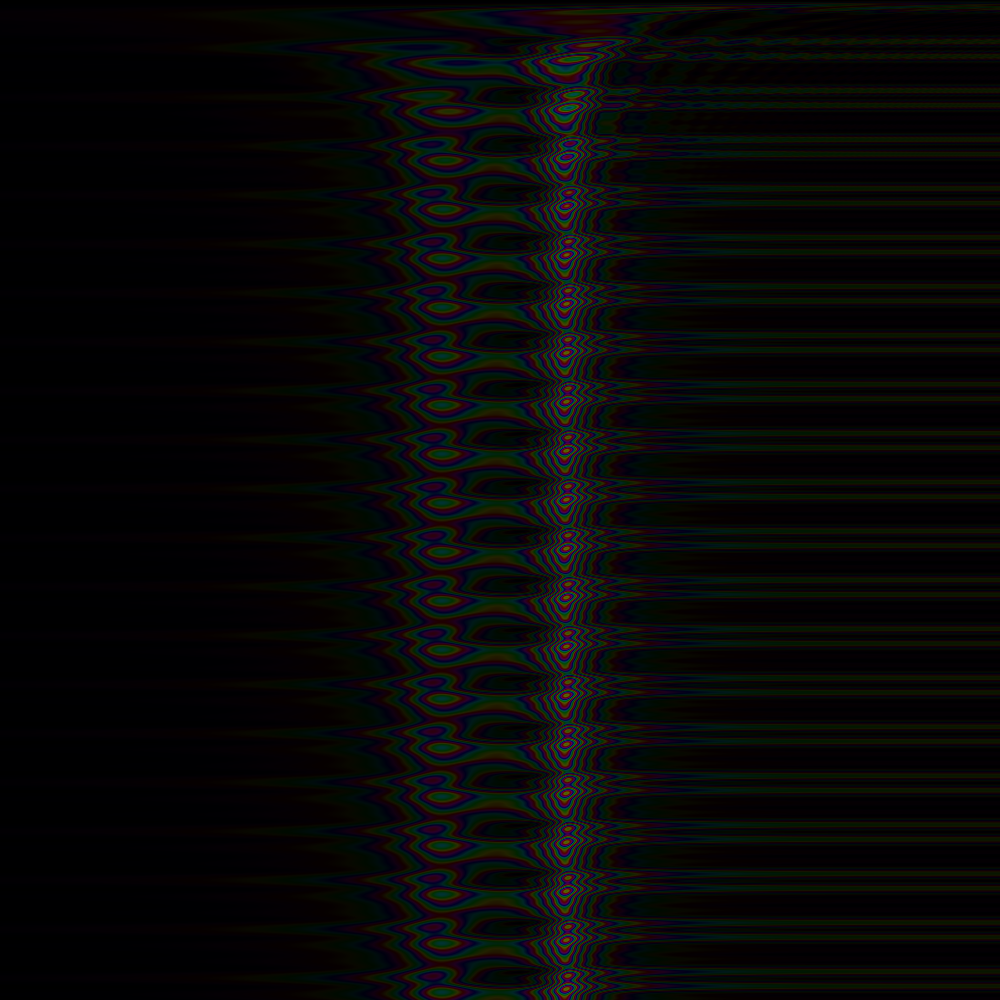
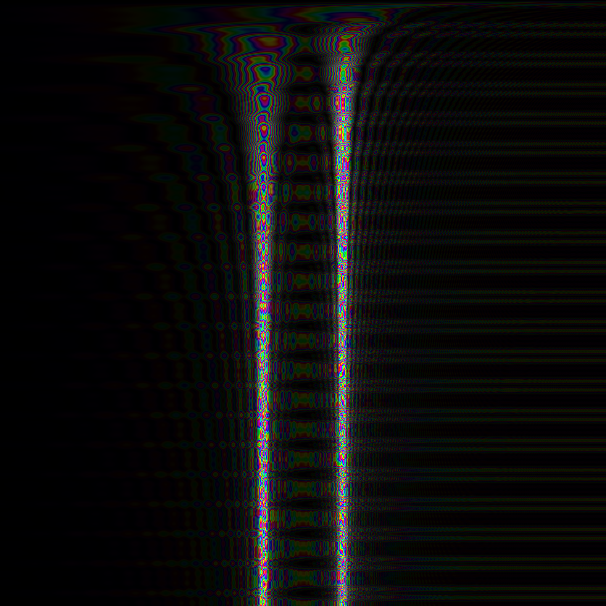
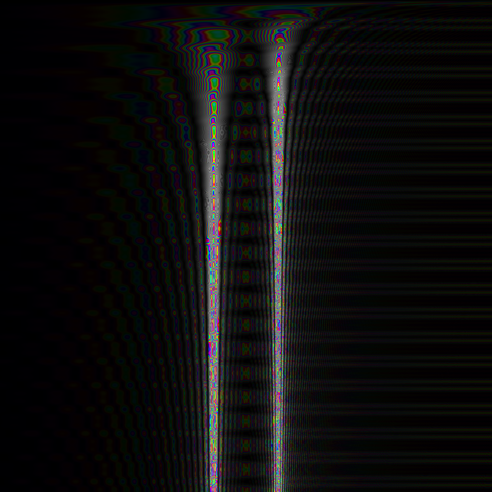
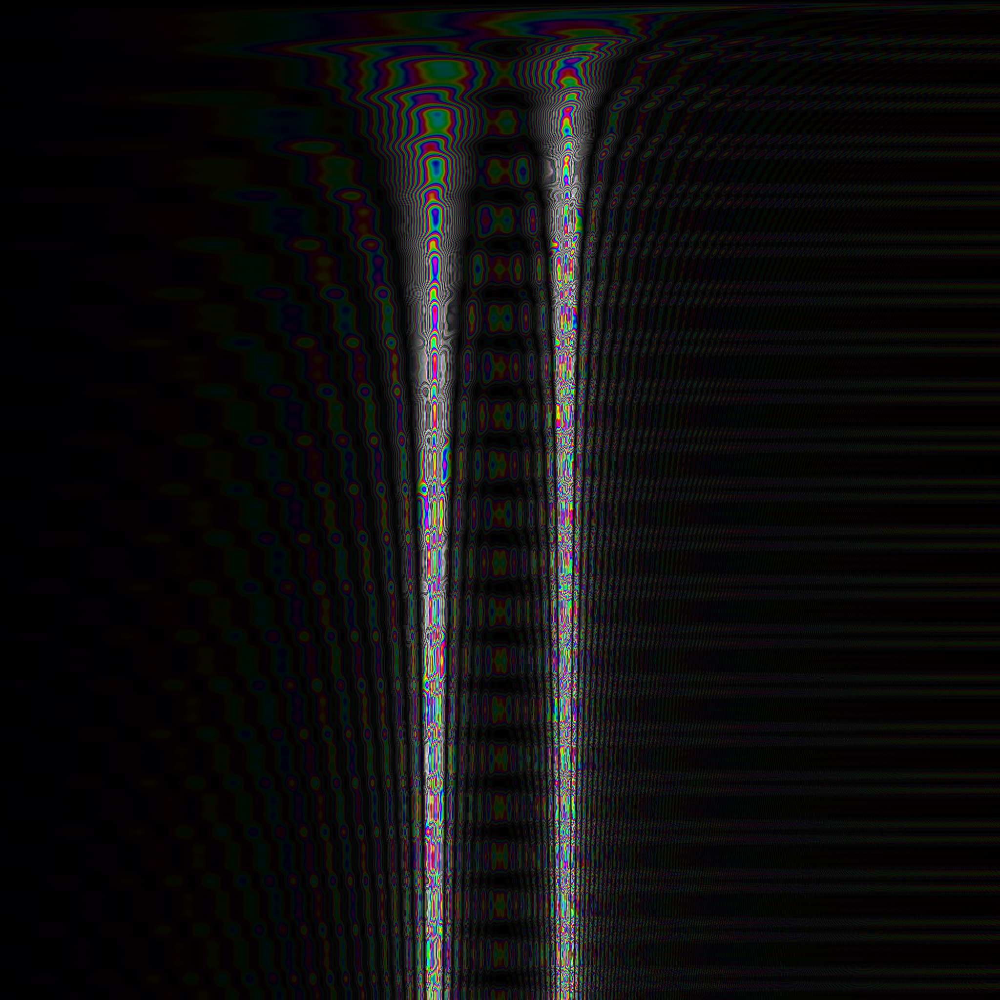

Discrete Spectral Transformation
================================

The Discrete Spectral Transformation (“DST”) has been developed as an alternative to the Discrete Fourier Transformation (“DFT”) and it's fast variant, the Fast Fourier Transformation (“FFT”).

DST vs. DFT/FFT Design Philosophy
---------------------------------

While the FFT works very well and fast when determining the spectrum of a signal now and then, it does not all work well when applied on a sample-by-sample level:

* Given an algorithmic performance of O _(n\*log(n))_, where _n_ is the window size of the FFT, computating the FFT for a _series_ of _m_ adjacent samples in a signal results in O _(m\*n\*log(n))_.
* The Fourier Transformation is designed to be applied on the _complete_ signal, starting at a point indefinitely in the past and reaching into indefinite future: the Fourier integral integrates from _t=-∞_ to _t=+∞_, and the Fourier series assumes the signal is periodic.  Hence, in practice, a window function is used to mask a region of interest in the signal, and this region is used for a periodic continuation of the signal.  This is fine, if the window is large and the spectrum does not change quickly, but it will lead to major inaccuracy otherwise.  Even worse, since the signal is periodically continuated, at the point of continuation, the function will be a non-steady, thus resulting in high peaks in the resulting spectrum from the DFT or FFT, just for the fact, that the original signal was tweaked by continuation.  Therefore, the window function is usually combined with a Gausian filter that fades out the signal towards the continuation point, to avoid the peaks.  That way, however, the resulting spectrum gets even more imprecise and even slower response to quick changes in the spectrum.  
While this objective may sound strange, there is a convincing example.  Imagine a signal consisting purely of a constant sine wave that, after a long time, is suddenly turned off, thus leaving perfect silence.  When the sine wave stops, the spectrum should also fade out and approximate to perfect silence.  However, the spectrum of a Fourier transform is not a function over time: it does not contain time as parameter, in contrast to the signal.  That is, it does not matter if the sine wave has already stopped or not – the spectrum is always the same.

In contrast, the DST is designed to be applied on a sample-by-sample level.  Rather than re-computing the spectrum from scratch for each sample, it re-uses the result from the previous calculation of the spectrum, and just considers, how the next samples changes the spectrum.  That is, for each new sample, the spectrum is updated to include the contribution of that sample to the current spectrum.  Also, the spectrum fades out in a way such that the contribution of samples seen long ago continously decreases.

Computational Complexity
------------------------

The DST beats the DFT / FFT in terms of computational complexity, if a sample-by-sample _series_ of spectrum frames is to be computed.  However, the FFT beats the DST for the computation of a single spectrum frame.

### Serial Execution

For a single determination of the spectrum over _m=n_ samples, the FFT with window size _n_ takes O _(n\*log(n))_, while the DST takes O _(m\*n)_=O _(n²)_ for _m_ samples and _n_ spectrum lines.  That is, for determining once the spectrum over a limited range of a single, FFT is faster than DST.

However, for a series of spectrum analyses on a sample-by-sample basis over _m_ samples, FFT takes O _(m\*n\*_ log _(n))_, while DST only requires O _(m\*n)_.

### Parallel Execution

DFT and DST can be parallelized by computing each spectral line by a completely separate processor, just sharing the same input signal.  In contrast, the FFT uses a matrix multiplication (in order to reduce the number of multiplications) such that parallelization is limited.  The butterfly step in the course of an FFT computation can not be fully parallelized due to the data dependencies across the spectral lines.

When computing all spectral lines independently from each other on a separate processor, the DST performs in _O(1)_ for updating the spectral line when processing the next sample, assuming the number of available processors grows with the number of spectral line to be processed.  The DST takes _O(m)_ for the same task, assuming a window with _m_ samples.

There are various approaches to parallize FFT, but as far as to my knowledge, all of them have at least _O(log n)_ complexity.

Numerical Precision of the Transformation
-----------------------------------------

DST as well as DFT and FFT assume discrete time and thus will have by design 
DFT and FFT use a window function and typcially a Gaussian filter, thus resulting in imprecise calculation of the spectrum and slow response to quick changes in the spectrum.  The DST, however, gives more precise results and has much higher response to quick changes in the spectrum.

Numerical Precision of the Reverse Transformation
-------------------------------------------------

In my original conference presentation [1], I stated that for the reverse transformation of the DST, while the mathematical foundation is clear, I still have no practical algorithm.  In fact, at that time I already almost had a working algorithm; it turned out there just was a subtle bug in the numeric processing of complex numbers.  Actually, the reverse transformation mostly boils down to summing up all values of the spectral lines of the transformed signal.  This characteristics is what you really should expect from a transformation that deserves the attribute “spectral” in its name.  For implementation details, just have a look at method 'getReconstructedSample()' in class 'DSTSlidingWindow' to see how simple it works.

The current DST implementation still has problems with numerical stability.  While for a limited number of subsequent samples the reverse transformation works fine, when reverting a large number of successive samples, spectral lines have a tendency to produce small oscillations that contribute to a distorted reconstruction of the signal.  I am still working on alleviating this deficiency.

The Coupling Constant
---------------------

The DST uses a _coupling constant_ _μ0_ that determines how much influence the next sample has and how fast the contribution of past samples fades out.  That way, the coupling constant somewhat can be compared to the turnover frequency _τ_ in a low pass filter.  The following series of spectrum views depicts the behavior of the DST for varying values of the coupling constant.  The diagrams show the spectrum with the time axis from top to down, and the frequency axis from left to right.  The value of _μ0_ must be less than 1 for the integral of the DST transformation to converge.  The higher the value, the greater the influence of past samples is retained, but also the slower the DST reacts to quick changes in the spectrum, as the following figures show for several values of _μ0_.

  <figure>
    
    <figcaption>Fig. 1a: μ0=0.9</figcaption>
  </figure>

  <figure>
    
    <figcaption>Fig. 1b: μ0=0.99</figcaption>
  </figure>

  <figure>
    
    <figcaption>Fig. 1c: μ0=0.999</figcaption>
  </figure>

  <figure>
    
    <figcaption>Fig. 1d: μ0=0.9999</figcaption>
  </figure>

  <figure>
    
    <figcaption>Fig. 1e: μ0=0.99999</figcaption>
  </figure>

  Fig. 1: DST Convergence for Combined 440Hz+880Hz Sine Waves @ 44.1kHz Sample Frequency

The figures suggest that the value of the coupling constant should be greater than 0.99 in order to retrieve good accuracy, but values greater than 0.999 do not add much more to it, but degrade responsiveness in the case of a quickly changing spectrum.  Hence, a good trade-off between accuracy and responsiveness (this a kind of uncertainty relation!) is a value inbetween, e.g. the value _1-α_ with _α_ := _1-_ Rt150 _(1/3)_, where Rt150 _(x)_ denotes the 150th root of _x_, i.e. Rt150 _(x)_ := exp _(1 / 150 \*_ log _(x))_.

For a more comprehensive discussion of the mathematics behind the DST, see the article of my presentation at the Linux Audio Conference LAC2009 [1].

[TODO: Compile a list of errata that I meanwhile found in the conference article.]

References
----------

[1] Jürgen Reuter: Considering Transient Effect in Spectrum Analysis.  In _Proceedings of the Linux Audio Conference, LAC 2009_, April 18, 2009, Parma, Italy.  Downloadable [here](media/lac2009_spectral_transform.pdf).
