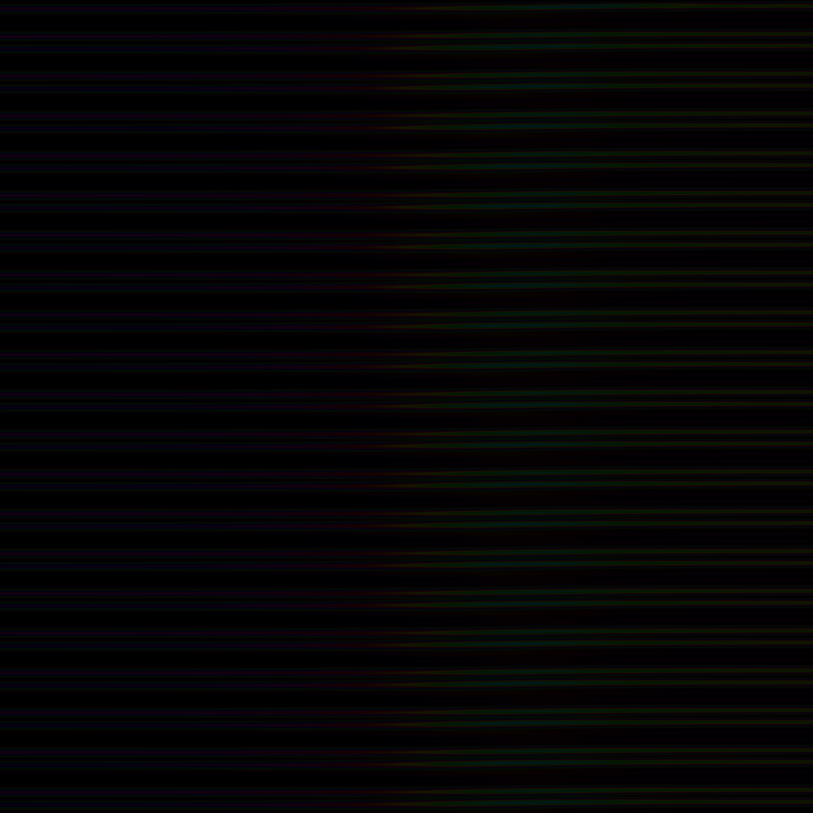
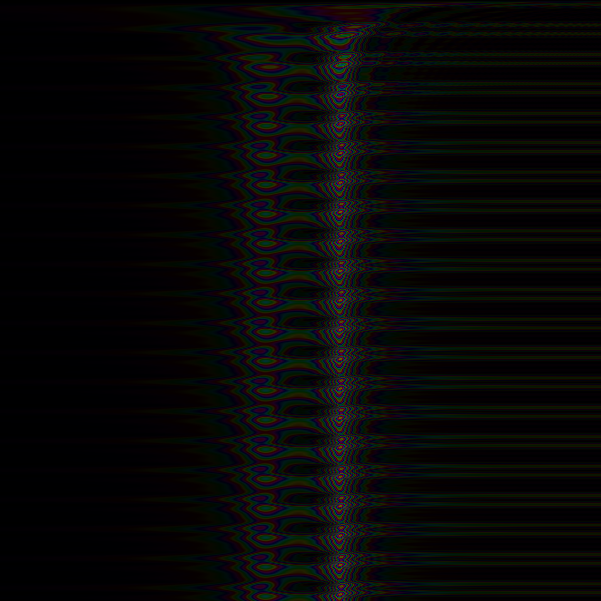
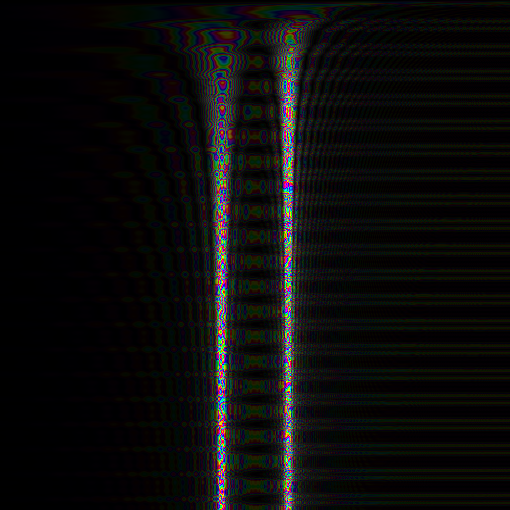
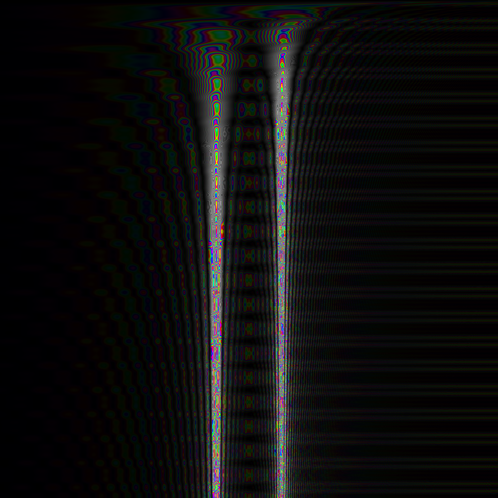
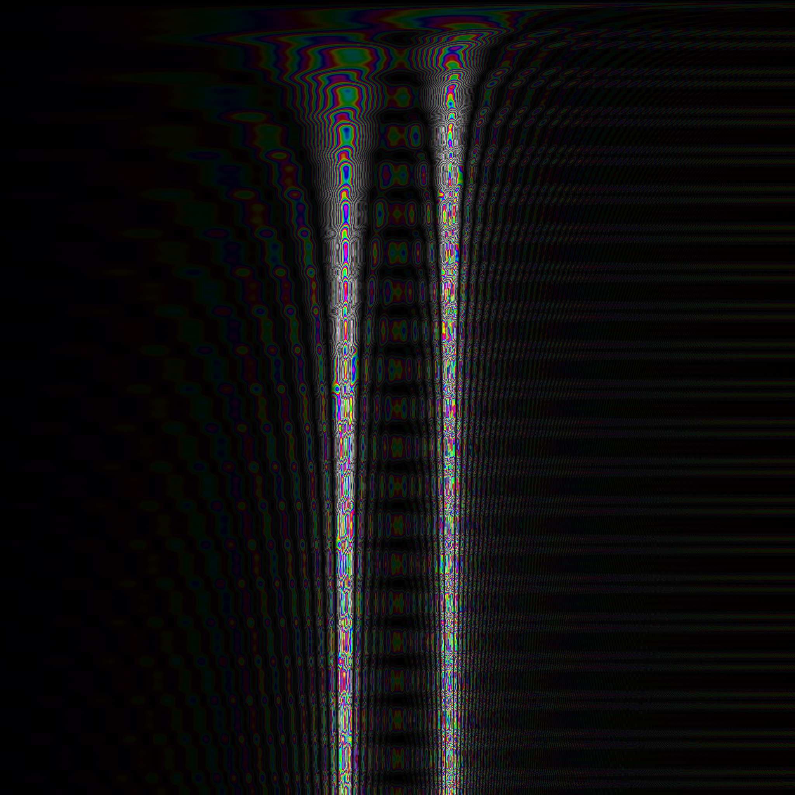

Discrete Spectral Transformation
================================

The Discrete Spectral Transformation (“DST”) has been developed as an alternative to the Discrete Fourier Transformation (“DFT”) and it's fast variant, the Fast Fourier Transformation (“FFT”).

DST vs. DFT/FFT Design Philosophy
---------------------------------

While the FFT works very well and fast when determining the spectrum of a signal now and then, it does not all work well when applied on a sample-by-sample level:

* Given an algorithmic performance of O _(n\*log(n))_, where _n_ is the window size of the FFT, computating the FFT for a _series_ of _m_ adjacent samples in a signal results in O _(m\*n\*log(n))_.
* The Fourier Transformation is designed to be applied on the _complete_ signal, starting from indefinite past and reaching into indefinite future: the Fourier integral integrates from _t=-∞_ to _t=+∞_, and the Fourier series assumes the signal is periodic.  Since in real-world applications, only a limited time range of a technical signal is available, a window function is used to mask a region of interest in the signal, and this region is used for a periodic continuation of the signal.  This is fine, if the window is large and the spectrum does not change quickly, but it will lead to major inaccuracy otherwise.  Even worse, since the signal is periodically continuated, at the point of continuation, the function will usually be non-steady, thus leading to high peaks in the resulting spectrum from the DFT or FFT, just for the fact that the original signal was tweaked by continuation.  Therefore, the window function is usually combined with a Gausian filter that fades out the signal towards the continuation point, to avoid these peaks.  This way, however, the resulting spectrum becomes even more imprecise and exhibits even slower response to quick changes in the spectrum.  While this objective may sound strange, there is a convincing example.  Imagine a signal consisting purely of a constant sine wave that, after a long time, is suddenly turned off, thus leaving perfect silence.  When the sine wave stops, the spectrum should also fade out and approximate to perfect silence.  However, the spectrum of a Fourier transform is not a function over time: it does not contain time as parameter, in contrast to the signal.  That is, it does not matter if the sine wave has already stopped or not – the spectrum is always the same.

In contrast, the DST is designed to be applied on a sample-by-sample level.  Rather than re-computing the spectrum from scratch for each sample, it re-uses the result from the previous calculation of the spectrum, and just considers, how the next samples changes the spectrum.  That is, for each new sample, the spectrum is updated to include the contribution of that sample to the current spectrum.  Also, the spectrum fades out in a way such that the contribution of samples seen long ago continously decreases.

Computational Complexity
------------------------

The DST beats the DFT / FFT in terms of computational complexity, if a sample-by-sample _series_ of spectrum frames is to be computed.  However, the FFT beats the DST for the computation of a single spectrum frame.

### Serial Execution

For a single determination of the spectrum over _m=n_ samples, the FFT with window size _n_ takes O _(n\*log(n))_, while the DST takes O _(m\*n)_=O _(n²)_ for _m_ samples and _n_ spectrum lines.  That is, for determining once the spectrum over a limited range of a single, FFT is faster than DST.

However, for a series of spectrum analyses on a sample-by-sample basis over _m_ samples, FFT takes O _(m\*n\*_ log _(n))_, while DST only requires O _(m\*n)_.

### Parallel Execution

DFT and DST can be parallelized by computing each spectral line by a completely separate processor, just sharing the same input signal.  In contrast, the FFT uses a matrix multiplication (in order to reduce the number of multiplications) such that parallelization is limited.  The butterfly step in the course of an FFT computation can not be fully parallelized due to the data dependencies across the spectral lines.

When computing all spectral lines independently from each other on a separate processor, the DST performs in _O(1)_ for updating the spectral line when processing the next sample, assuming the number of available processors grows with the number of spectral line to be processed.  The DST takes _O(m)_ for the same task, assuming a window with _m_ samples.

There are various approaches to parallize FFT, but as far as to my knowledge, all of them have at least _O(log n)_ complexity.

Numerical Precision of the Transformation
-----------------------------------------

DST as well as DFT and FFT assume discrete time and thus will have by design 
DFT and FFT use a window function and typcially a Gaussian filter, thus resulting in imprecise calculation of the spectrum and slow response to quick changes in the spectrum.  The DST, however, gives more precise results and has much higher response to quick changes in the spectrum.

Numerical Precision of the Reverse Transformation
-------------------------------------------------

In my original conference presentation [Reuter:2009a], I stated that for the reverse transformation of the DST, while the mathematical foundation is clear, I still have no practical algorithm.  In fact, at that time I already almost had a working algorithm; it turned out there just was a subtle bug in the numeric processing of complex numbers.  Actually, the reverse transformation mostly boils down to summing up all values of the spectral lines of the transformed signal.  This characteristics is what you really should expect from a transformation that deserves the attribute “spectral” in its name.  For implementation details, just have a look at method 'getReconstructedSample()' in class 'DSTSlidingWindow' to see how simple it works.

The current DST implementation still has problems with numerical stability.  While for a limited number of subsequent samples the reverse transformation works fine, when reverting a large number of successive samples, spectral lines have a tendency to produce small oscillations that contribute to a distorted reconstruction of the signal.  I am still working on alleviating this deficiency.

The Coupling Constant
---------------------

The DST uses a _coupling constant_ named _μ0_, a dimensionless quantity that determines how much influence the next sample has and how fast the contribution of past samples fades out.  One can think of a strong correlation between the coupling constant and the turnover frequency _τ_ in a low pass filter, especially if implemented as a discrete infinite impulse response filter.

The following series of spectrum views depicts the behavior of the DST for varying values of the coupling constant.  The diagrams show the spectrum with the time axis from top to down, and the frequency axis from left to right.  The value of _μ0_ must be less than 1 for the integral of the DST transformation to converge.  The higher the value, the greater the influence of past samples is retained, but also the slower the DST reacts to quick changes in the spectrum, as the following figures show for several values of _μ0_.

  <figure>
    
    <figcaption>Fig. 1a: <i>μ0</i> = 0.9</figcaption>
  </figure>

  <figure>
    
    <figcaption>Fig. 1b: <i>μ0</i> = 0.99</figcaption>
  </figure>

  <figure>
    
    <figcaption>Fig. 1c: <i>μ0</i> = 0.999</figcaption>
  </figure>

  <figure>
    
    <figcaption>Fig. 1d: <i>μ0</i> = 0.9999</figcaption>
  </figure>

  <figure>
    
    <figcaption>Fig. 1e: <i>μ0</i> = 0.99999</figcaption>
  </figure>

  Fig. 1: DST Convergence for Combined 440Hz+880Hz Sine Waves @ 44.1kHz Sample Frequency

The figures suggest that the value of the coupling constant should be greater than 0.99 in order to retrieve good accuracy, but values greater than 0.999 do not add much more to it, but degrade responsiveness in the case of a quickly changing spectrum.  Hence, a good trade-off between accuracy and responsiveness (this is a kind of uncertainty relation!) is a value inbetween, e.g. the value _1-α_ with _α_ := _1 -_ 150√(1/3), where 150√(_x_) denotes the 150th root of _x_, i.e. 150√(_x_) := exp _(1 / 150 \*_ log _(x))_.  Thus, the expression results in _α ≈ 0.007297326_ or _μ0 ≈ 0.992702673_.

Sliding Window DFT Implementation
---------------------------------

For better comparison, the library not only features the DST implementation, but also comprehends a sliding window implementation of a DFT.  This DFT implementation keeps track of all sample values in the window with a ring buffer: each time a new sample is added to the window, the oldest one is kicked off.  No Gaussian or other filter is applied.  Note that this DFT implementation is feasible only for small window sizes due to the ring buffer.  The DST does not need such a ring buffer, since instead, old samples are faded out.  Since in this DFT implementation old samples are not faded out until they fall off from the window, new incoming samples affect the overall spectrum of the DFT much less.  As a consequence, the DFT responses much more slowly to quick changes in the spectrum.  For steady signals however, this DFT implementation works almost equally well compared to the DST, while still having the overhead of keeping track of all samples in the window.

  <figure>
    
    <figcaption>Fig. 2: Sliding Window DFT</figcaption>
  </figure>

Additional Remarks
------------------

Note that — while so far mostly applied on accoustics — the DST may be applied to any field in physics where decomposition of a signal into sinoidal waves is desired.

Also note that the DST has some remarkable differences compared to the DFT:

* The DFT's symmetry of cause and effect is mainly due to the symmetric bounds of the integral of the Fourier transform or the signal periodicity for a Fourier series.  In contrast, the integral of the DST is bound to (-∞,0], thus keeping direction of causality.

* The Fourier transform abstracts from the signal's _t_ parameter, such that it does not occur any more in the transformed signal.  In contrast, the DST preserves the _t_ parameter, thus keeping an additional variable in the frequency space.  This additional variable can be viewed as a _hidden variable_ (in the sense as some authors assume for Quantum mechanics) of the Fourier transform, explicitly made accessible via the DST: For any point _t1_ in time, the DST for that point can be computed solely from the DST for any earlier point _t0_ in time and the signal between these two points _t0_ and _t1_, as shown in Eqn. 24 in the paper in Sect. 4.3 “Discretization” [Reuter:2009a].  That is, the DST for _t0_ holds _all_ necessary information from the _complete_ history before _t0_ that is required for computing the DST of some later point _t1_.

Purely Speculative Expression Matching
--------------------------------------

The following ideas in this section are random number and expression
patterns that I recognized while working on the overall concepts.

__DISCLAIMER:__ Please do not take these ideas as necessarily real
physical facts, but just as inspiring ideas for working out future
concepts.  Having that said, here we go.

Remember that the non-negative parameter _μ0_ in our
transformation serves as a constant for coupling over time, i.e. how
fast the effect of the signal onto the spectrum decays over time.  For
the transformation's integral to converge, this constant requires to
have a value of less than 1.  In the course of this loose discussion
however, just forget for a moment about this requirement.  Actually,
we are not going to compute the transformation here, hence we do not
need the integral to converge.

In physics there is actually something like a coupling constant: the
_fine structure constant_ _α_ ≈ 7.297353e-3.  Let's take the value of
1 / _α_ ≈ 137.036 as value for _μ0_, even though it is not
less than 1, but much greater than 1.  In our transformation, the
parameter appears as part of exponent of the natural _e_ function,
i.e. we consider the expression exp(1 / α).

Next, in the paper, we reason about discretization of the
transformation.  In physics, is there a discretization in terms of
space?  In some sense, there probably is: The Planck length
_lp_ ≈ 1.616e-35m.  Let us take this value as basic unit,
i.e. as a factor multiplied with what to come next.

Finally, remember that our transformation is scaled with a factor
equal to the constant value that appears in the exponent of the _e_
function.  Let's do this here as well, i.e. scale the expression by
the factor (1 / _α_).

So, altogether, in terms of _α_, we get the function

  _f_(_α_) := _lp_ * (1 / _α_) * exp(1 / _α_)

which evaluates to

  _f_(_α_) ≈ 7.231e26m.

Maybe think of a wave with an extremely low frequence, maybe just as
low that is spreads out just making up a single, huge period that
covers all of the universe that we can recognize.  The _minimum_
extent of the universe is that of the _observable_ universe and is
said to be around 93 billions (93 * 109) of light-years
[Wikimedia:2019a].  Note that physicists believe in something called
_dark matter_ that is thought to make up maybe up to 85% of all
matter, thus making the real size of the universe much bigger, without
being able to quantify that size.  For the purpose of our discussion,
let's consider just the _observable_ part of the universe, thus
assuming an extent of roughly 93 light-years.

With 1 light-year = 1ca (with letter c denoting speed of light and
letter a denoting a year), we get an extent _d_ of

_d_ ≈ 93e9ca ≈ 93e9 * 3e8 m/s * 365.25 * 24 * 60 * 60 s ≈ 8.804e26m

Well, _d_ ≈ 8.804e26m and _f_(_α_) ≈ 7.231e26m are pretty close,
aren't they?  They are off not much more than 20% from each other,
while spanning a range of 61 decades from _lp_ to _d_.

Hence, let us assume these two numbers are actually identical, and the
difference only results from measurement tolerance.

Next, we assume an _almost_ linear expansion of the universe,
according to the Lambda-CDM model [Wikimedia:2019b], [Wikimedia:2017]
during its age of roughly 13.8e9 years.

Given these assumptions, we can compute an approximation of the
_drift_ of the the fine structure constant over time: It should
currently decrease by a value of roughly 3.83e-15 per year.  The
computation is elaborated in the Java files `SolveExpEqDouble.java`
and `SolveExpEqBigDecimal.java`, respectively.

Future Work
-----------

On the 16th International Linux Audio Conference (LAC2018) in Berlin, Westerfeld presented an open-source implementation of a sound morphing algorithm [Westerfeld:2018] built upon previous work of Serra and Smith.  Westerfeld concludes his work listing almost exactly those deficiencies of the FFT that the DST addresses.  Hence, replacing the FFT in Westerfeld's implementation with the DST may turn out as a breakthrough showcase application for the DST.

References
----------

For a more comprehensive discussion of the mathematics behind the DST, see the article of my presentation at the Linux Audio Conference LAC2009 [Reuter:2009a].

[TODO: Compile a list of errata that I meanwhile found in the conference article.]

[Reuter:2009a] Jürgen Reuter.  _Considering Transient Effect in Spectrum Analysis._  In _Proceedings of the 7th International Linux Audio Conference (LAC2009)._  Instituzione Casa della Musica, Parma, Italy.  Grafiche Step, Parma, Italy, pp. 153—160, April 16th—19th, 2009.  [download](media/lac2009_spectral_transform.pdf).

[Westerfeld:2018] Stefan Westerfeld.  _SpectMorph: Morphing the Timbre of Musical Instruments._  In _Proceedings of the 16th International Linux Audio Conference (LAC2018)._  c-base, Berlin.  Germany, pp. 5—12, June 7th—10th, 2018.

[Wikimedia:2019a] Wikipedia, the free encyclopedia.  _Observable
universe._ https://en.wikipedia.org/wiki/Observable_universe, April
23, 2019.

[Wikimedia:2019b] Wikipedia, the free encyclopedia.  _Lambda-CDM
model._ https://en.wikipedia.org/wiki/Lambda-CDM_model, April 27,
2019.

[Wikimedia:2017] Wikipedia, the free encyclopedia.  _File:Mplwp
universe scale evolution.svg._
https://commons.wikimedia.org/wiki/File:Mplwp_universe_scale_evolution.svg,
April 17, 2017.
